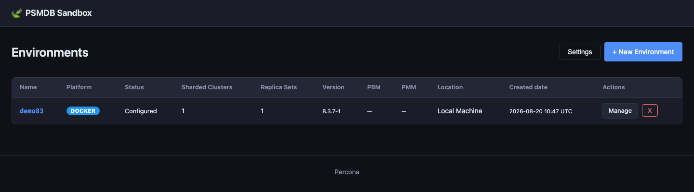
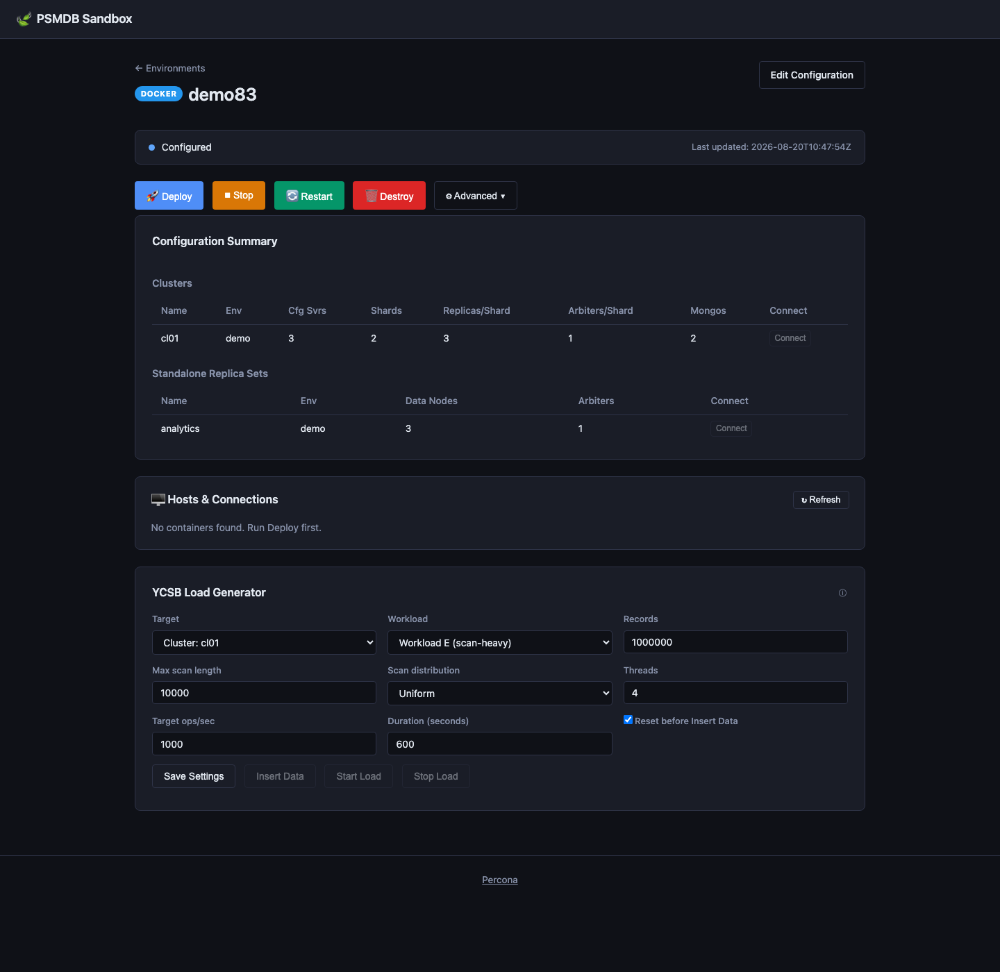
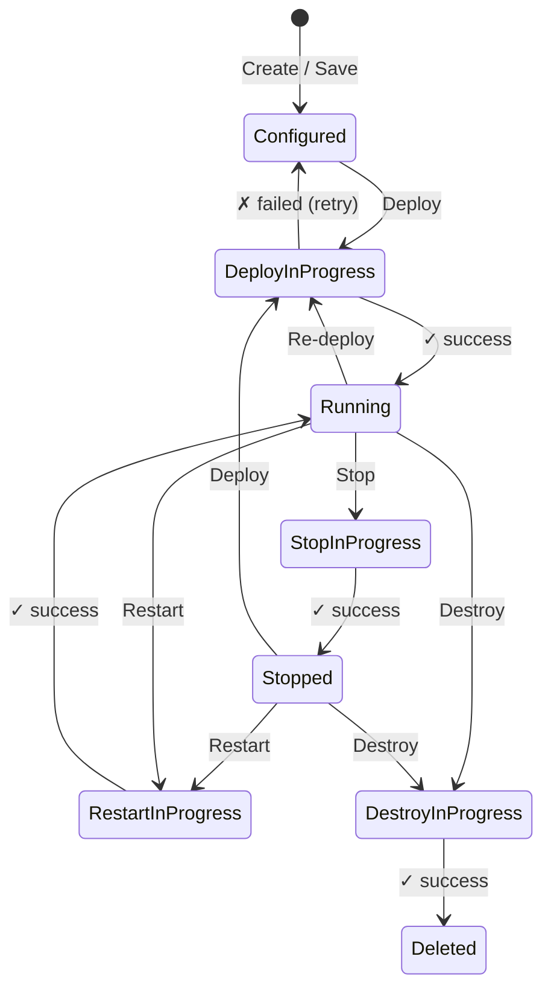
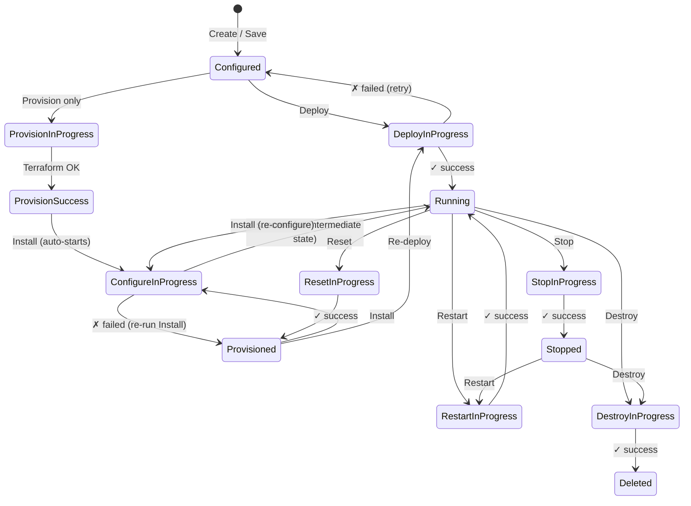

# PSMDB Sandbox

A portable, zero-dependency web frontend for **mongo_terraform_ansible** written in Go.

## Overview

The UI lets you configure, deploy, stop, restart, reset, and destroy environments without
editing `.tfvars` files manually. It writes Terraform variable files into the matching
`terraform/<platform>/` directory and streams job output live in the browser.

Supported platforms:

- AWS
- GCP
- Azure
- CHAOS
- Docker

## Requirements

- **Go 1.22+**

Optional, depending on the environment type you want to deploy:

- [Terraform](https://developer.hashicorp.com/terraform/downloads) 1.0+
- [Ansible](https://docs.ansible.com/ansible/latest/installation_guide/) for AWS, GCP, Azure, and CHAOS
- [Docker](https://docs.docker.com/get-docker/) for Docker environments
- Cloud CLIs for the target platform. Provider credentials can be configured in the UI Settings using isolated key/service-account credentials.

## Quick Start

```bash
cd ui-go
go run .
```

Then open `http://127.0.0.1:5001` in your browser.

To build a binary:

```bash
cd ui-go
go build -o mongodeploy .
./mongodeploy
```

## Environment Variables

| Variable      | Default           | Description                                                    |
|---------------|-------------------|----------------------------------------------------------------|
| `PORT`        | `5001`            | TCP port to listen on                                          |
| `UI_HOST`     | `127.0.0.1`       | Bind address; use `0.0.0.0` to listen on all interfaces        |
| `UI_BASE_DIR` | current directory | Override the base directory; must contain `templates/` and `static/` |

## Screenshots

### Environment list — multiple clusters at a glance



### Environment detail — current management view

The environment detail page shows the current status, primary actions,
configuration summary, service links, and automatically loads the
**Hosts & Connections** panel after infrastructure is available.



---

## State transition diagrams

### Docker



### Cloud (AWS / GCP / Azure)



> **Note:** Every `*InProgress` state may transition back to the **previous
> stable state** on failure (shown as "retry" for brevity).  There is **no**
> `ConfigureSuccess` state — a successful Ansible run goes directly to
> **Running**.

---

## Environment states

| Status                    | Platform        | Meaning                                                                                                           |
|---------------------------|-----------------|-------------------------------------------------------------------------------------------------------------------|
| **Configured**            | all             | Saved but no infrastructure exists yet.                                                                           |
| **Deploy In Progress**    | all             | Terraform (+ Ansible for cloud) running in the background.                                                        |
| **Running**               | all             | All resources up and healthy. Reached after `Deploy`, `Install`, or `Restart`.                                    |
| **Stopped**               | all             | Resources gracefully stopped (`docker stop` / Ansible stop playbook).                                             |
| **Provision In Progress** | cloud only      | Terraform provisioning infra (no Ansible yet).                                                                    |
| **Provision Success**     | cloud only      | Terraform done; Ansible `Install` step starting automatically.                                                    |
| **Provisioned**           | cloud only      | Infra exists but Ansible has not run yet. Set after `Reset` or configure failure — run `Install` to continue.     |
| **Configure In Progress** | cloud only      | Ansible playbooks running. On success → **Running** (there is no `Configure Success` state).                      |
| **Destroy In Progress**   | all             | `terraform destroy` running.                                                                                      |
| **Destroy Success**       | all             | All resources destroyed. Record kept until manually purged.                                                       |
| **Deleted**               | all             | Record removed from the UI list.                                                                                  |
| **\*\_Failed**            | all             | Any action may fail; the status becomes `<action>_failed`. Re-run the action to retry.                            |

## How it works

1. **Platform selection** – choose AWS, GCP, Azure, CHAOS or Docker.
2. **Configuration wizard** – fill in cluster topology, images/packages, credentials,
    networking, and (for cloud platforms) per-component instance types and disk sizes.
    - Image tags are fetched live from Docker Hub on startup and cached for 5 minutes.
    - Docker deployments can change the Percona image namespace, for example from
      `percona` to `perconalab`, while still using the same tag dropdowns.
    - Percona package release identifiers (`psmdb-80`, …) are fetched from the Percona
      repository listing on startup.
    - Cloud deployments can select `release`, `testing`, or `experimental` Percona
      repository channels for MongoDB, PBM, and PMM client packages.
    - Each cluster and replica set includes audit plugin controls. Audit is disabled by
      default. Docker environments use the built-in write-only filter for non-system users
      unless you override it.
    - Optional YCSB workload generation can be enabled for Docker and cloud environments.
3. **Save** – writes `<env_id>.tfvars` inside the corresponding `../terraform/<platform>/`
   directory and records the environment in `environments.json`.
4. **Deploy** – runs `terraform init && terraform apply` (and Ansible for cloud platforms)
   in a background goroutine. Output is streamed live via Server-Sent Events.
   If an existing environment's topology changed, the UI compares the saved desired
   topology with the last successful deploy before running Terraform.
5. **Stop / Restart** – for Docker environments, uses `docker stop` / `docker restart`
   filtered by the environment prefix; for cloud environments, runs the Ansible
   `stop.yml` / `restart.yml` playbooks.
6. **Destroy** – runs `terraform destroy`. On success the environment is automatically
   removed from the inventory and the browser redirects to the environments list.
7. **Hosts & Connections** – after a successful deploy the environment detail page shows
   every host or container with its IP address, a copy-pasteable connect command
   (`ssh user@host` or `docker exec -it <name> bash`), MongoDB connection strings for
   every replica set and cluster, and clickable **Open** buttons for PMM and MinIO
    Console URLs. All PMM-related containers (server, Grafana renderer, Watchtower,
    and per-node PMM client sidecars) are grouped together under a single **PMM** section.

## Cloud Provider Credentials

Open **Settings** from the environments page and configure credentials for the cloud provider you want to use:

- AWS: access key ID, secret access key, profile, and default region. The UI writes isolated AWS config files under `ui-go/secrets/cloud/aws/` and runs Terraform with `AWS_SHARED_CREDENTIALS_FILE`, `AWS_CONFIG_FILE`, and `AWS_PROFILE`.
- GCP: service account JSON file and project ID. The UI stores the uploaded key under `ui-go/secrets/cloud/gcp/`, uses an isolated `CLOUDSDK_CONFIG`, and runs Terraform with `GOOGLE_APPLICATION_CREDENTIALS`.
- Azure: service principal tenant ID, subscription ID, client ID, and client secret. The UI uses an isolated `AZURE_CONFIG_DIR` and runs Terraform with the matching `ARM_*` environment variables.

Use the provider-specific **Configure** button after entering credentials, then **Test** to validate them. Deploy, Provision, and Destroy validate provider credentials before Terraform runs.

## YCSB Workloads

When **Include YCSB** is enabled, the UI provisions a dedicated workload generator for Docker and cloud environments. After the environment is provisioned or running, each cluster and standalone replica set shows YCSB controls:

- **Insert Data** runs the initial YCSB load.
- **Start Load** starts a background workload against the selected target.
- **Stop Load** stops the active workload.

For Docker, the UI runs YCSB inside the generated YCSB container. For cloud platforms, it connects to the generated YCSB host over SSH and runs `/opt/ycsb/bin/ycsb`.

## Topology Expansion

The UI supports additive topology changes for deployed environments:

- Increase `shard_count` to add shards to an existing sharded cluster.
- Increase `data_nodes_per_replset` to add data-bearing members to an existing standalone replica set.
- Add a new sharded cluster or standalone replica set to an existing environment.

For cloud platforms, Deploy runs `terraform apply` first, then runs the matching Ansible scale-out playbook:

- `ansible/add_shard.yml` for each newly added shard.
- `ansible/add_replset_member.yml` for each expanded standalone replica set.
- `ansible/main.yml` for entirely new clusters or replica sets.

For Docker, Deploy runs Terraform only; the Docker Terraform modules run the supported MongoDB topology changes through their `null_resource` provisioners.

The UI refuses unsupported changes before Terraform runs:

- Reducing `shard_count` or `data_nodes_per_replset`.
- Changing `configsvr_count` after deployment.
- Changing `shardsvr_replicas` on existing shards.
- Changing `arbiters_per_replset` on existing sharded clusters or standalone replica sets.

Use **Deploy** for topology expansion. **Provision** is intentionally refused for topology expansion because it would only create infrastructure and would not run the required MongoDB reconfiguration playbook.

## File structure

```
ui-go/
├── main.go         Constants, globals, template helpers, HTTP routes, main()
├── types.go        All Go struct/type definitions and sorted-list helpers
├── state.go        Environment state persistence (load/save environments.json)
├── cache.go        In-memory TTL cache (Docker Hub tags, etc.)
├── versions.go     Docker Hub image tag fetching; Percona repo version discovery
├── tfvars.go       Terraform .tfvars file generation
├── jobs.go         Background job runner (start, stream, cancel, PID tracking)
├── regions.go      Cloud region and machine-image discovery (AWS / GCP / Azure)
├── hosts.go        Host & connection-string discovery (Docker + cloud inventory)
├── handlers.go     All HTTP handlers (environment CRUD, actions, API endpoints)
├── exec_helper.go  os/exec wrapper
├── go.mod          Go module (standard library only)
├── environments.json  Runtime state (auto-created)
├── jobs/              Background job logs (auto-created)
├── templates/
│   ├── layout.html
│   ├── index.html
│   ├── new_environment.html
│   ├── configure.html
│   └── environment.html
└── static/
    ├── style.css
    └── app.js
```

## Security note

This tool is intended for **local use only** (it binds to `127.0.0.1:5001` by default).
Do not expose it to the public internet without adding proper authentication.
