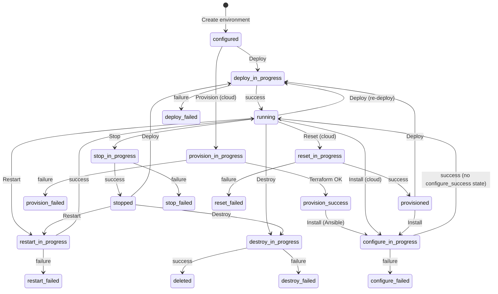

# MongoDB Deploy UI (Go)

A portable, zero-dependency web frontend for **mongo_terraform_ansible** written in Go.

---

## Screenshots

### Environment list — multiple clusters at a glance


### Environment detail — Hosts & Connections panel (Docker example)

After a successful deploy the **Hosts & Connections** panel appears automatically.
It shows every container (or cloud VM) with its IP address, a one-click copy command
(`docker exec` or `ssh`), ready-to-use MongoDB connection strings for every cluster
and replica set, and **Open** buttons for the PMM and MinIO Console web UIs.


---

## Environment state transitions



> **Note on configure:** When Ansible finishes successfully, the environment
> transitions directly to **Running** — there is no intermediate
> `configure_success` state.

---

## Environment states

| Status                       | Meaning                                                                                                                     |
|------------------------------|-----------------------------------------------------------------------------------------------------------------------------|
| **Configured**               | The environment has been saved but Terraform has not run yet. No cloud or Docker resources exist.                           |
| **Deploy In Progress**       | Terraform (and, for cloud platforms, Ansible) are running in the background.                                                |
| **Deploy Failed**            | The combined deploy action (Terraform + Ansible) encountered an error.                                                      |
| **Running**                  | All resources are up and healthy. This is the state after a successful `Deploy`, `Install` (configure), or `Restart`.      |
| **Stopped**                  | Resources were gracefully stopped (Docker containers stopped / Ansible stop playbook ran).                                  |
| **Provisioned**              | Terraform provisioning completed (infra exists) but Ansible has not run yet (cloud only). Set after a successful `Reset`.  |
| **Provision In Progress**    | Terraform is running (cloud-only provision step).                                                                           |
| **Provision Success**        | Terraform completed successfully. Transient state shown before the Ansible `Install` step begins.                           |
| **Provision Failed**         | Terraform encountered an error.                                                                                             |
| **Configure In Progress**    | Ansible configuration playbooks are running.                                                                                |
| **Configure Failed**         | Ansible encountered an error. There is no `Configure Success` state — success transitions directly to **Running**.          |
| **Stop In Progress**         | Stop playbooks / `docker stop` are running.                                                                                 |
| **Stop Failed**              | The stop action encountered an error.                                                                                       |
| **Restart In Progress**      | Restart playbooks / `docker restart` are running.                                                                           |
| **Restart Failed**           | The restart action encountered an error.                                                                                    |
| **Reset In Progress**        | The `reset.yml` Ansible playbook is running (cloud only).                                                                   |
| **Reset Failed**             | The reset action encountered an error.                                                                                      |
| **Destroy In Progress**      | `terraform destroy` is running.                                                                                             |
| **Destroy Success**          | Terraform destroyed all resources. The environment record is kept for reference and can be removed from the list.           |
| **Destroy Failed**           | `terraform destroy` encountered an error. Resources may still exist.                                                        |
| **Deleted**                  | The environment record has been removed from the UI list (only appears transiently during cleanup).                         |

---

## Requirements

- **Go 1.22+** (for `net/http` pattern-based routing with `{name}` params)

Optional (needed to actually run deployments):

- [Terraform](https://developer.hashicorp.com/terraform/downloads) ≥ 1.0
- [Ansible](https://docs.ansible.com/ansible/latest/installation_guide/) (for AWS / GCP / Azure deployments)
- [Docker](https://docs.docker.com/get-docker/) (for local Docker environments)
- Cloud CLI credentials configured in your environment (AWS CLI, `gcloud`, `az`, etc.)

---

## Quick Start

```bash
# From the repository root
cd ui-go
go run .
```

Or build a binary and run it from anywhere:

```bash
cd ui-go
go build -o mongodeploy .
./mongodeploy
```

Then open **http://127.0.0.1:5001** in your browser.

### Environment variables

| Variable       | Default           | Description                                                              |
|----------------|-------------------|--------------------------------------------------------------------------|
| `PORT`         | `5001`            | TCP port to listen on                                                    |
| `UI_HOST`      | `127.0.0.1`       | Bind address (use `0.0.0.0` for all interfaces)                          |
| `UI_BASE_DIR`  | current directory | Override the base directory (must contain `templates/` and `static/`)   |

---

## How it works

1. **Platform selection** – choose AWS, GCP, Azure, or Docker.
2. **Configuration wizard** – fill in cluster topology, images/packages, credentials,
   networking, and (for cloud platforms) per-component instance types and disk sizes.
   - Image tags are fetched live from Docker Hub on startup and cached for 5 minutes.
   - Percona package release identifiers (`psmdb-80`, …) are fetched from the Percona
     repository listing on startup.
3. **Save** – writes `<env_id>.tfvars` inside the corresponding `../terraform/<platform>/`
   directory and records the environment in `environments.json`.
4. **Deploy** – runs `terraform init && terraform apply` (and Ansible for cloud platforms)
   in a background goroutine. Output is streamed live via Server-Sent Events.
5. **Stop / Restart** – for Docker environments, uses `docker stop` / `docker restart`
   filtered by the environment prefix; for cloud environments, runs the Ansible
   `stop.yml` / `restart.yml` playbooks.
6. **Destroy** – runs `terraform destroy`. On success the environment is automatically
   removed from the inventory and the browser redirects to the environments list.
7. **Hosts & Connections** – after a successful deploy the environment detail page shows
   every host or container with its IP address, a copy-pasteable connect command
   (`ssh user@host` or `docker exec -it <name> bash`), MongoDB connection strings for
   every replica set and cluster, and clickable **Open** buttons for PMM and MinIO
   Console URLs.  All PMM-related containers (server, Grafana renderer, Watchtower,
   and per-node PMM client sidecars) are grouped together under a single **PMM** section.

---

## File structure

```
ui-go/
├── main.go            Complete Go application (server, types, handlers, jobs, tfvars)
├── exec_helper.go     os/exec wrapper
├── go.mod             Go module (standard library only)
├── environments.json  Runtime state (auto-created)
├── jobs/              Background job logs (auto-created)
├── templates/
│   ├── layout.html         Base HTML layout
│   ├── index.html          Environment list
│   ├── new_environment.html Platform picker
│   ├── configure.html      Configuration wizard
│   └── environment.html    Environment detail & actions
└── static/
    ├── style.css
    └── app.js
```

---

## Security note

This tool is intended for **local use only** (it binds to `127.0.0.1:5001` by default).
Do not expose it to the public internet without adding proper authentication.
